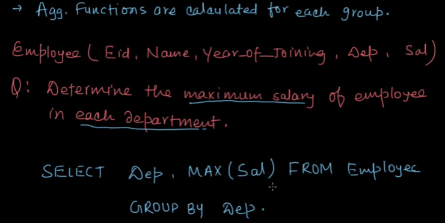
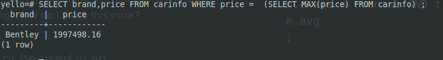
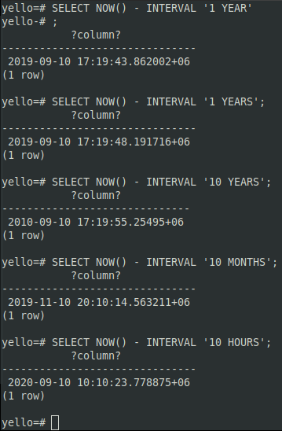
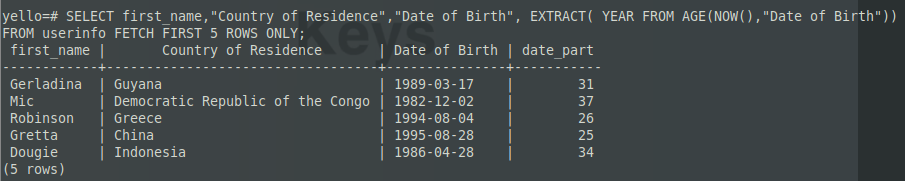
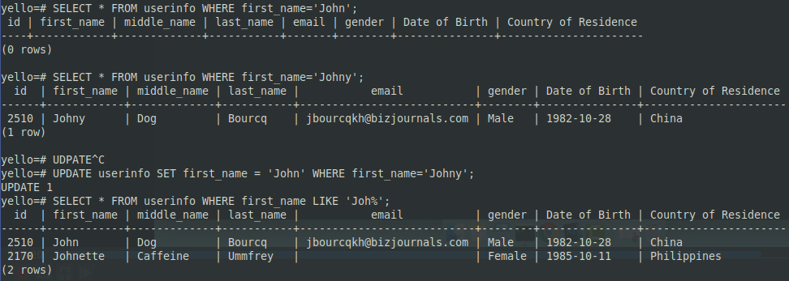

# Learning-Postgresql

---
Yello! This is me learning and 'documenting' what I learn about *PostgreSQL*. Take it as a daily ~~vlog~~ diary.

### Setting up in LinuxMint19:

Linux mint officially supports postgres v10. But postgres has v13 in beta !
[itsfoss.com](https://itsfoss.com/install-postgresql-ubuntu/) has a beginner friendly article about setting up postgres.

> Postgres (or all database softwares) has two components client and server. Also to interact with the database there are two ways: GUI (via *pgadmin*) and CommandLine (via *psql*)

To use `psql` and work with the databases, you need to login as postgresql user. By default there is a superuser name *postgres*, so you need to login as *postgres* before working with `psql`.

To make this easier, create another user with superuser privileges named $USER (your computer username). that way you are already logged in as a db user:
`sudo -u postgres createuser --superuser $USER`

PostgreSQL's official term is *roles*. More details in their [man page](https://www.postgresql.org/docs/8.1/user-manag.html) and in [flaviocopes.com](https://flaviocopes.com/postgres-user-permissions/)

Also there is database named after each user. Found a reason in the [internet](https://help.ubuntu.com/community/PostgreSQL) :
"Client programs, by default, connect to the local host using your Ubuntu login name and *expect* to find a database with that name too. So to make things REALLY easy, use your new superuser privileges granted above to **create a database with the same name as your login name**:"

So create a db named after $USER: `sudo -u postgres createdb $USER`

**All (database related) commands must end with a semicolon(;) as statement terminator.**

To create a database, type `CREATE DATABASE` followed by the database name of your choice.
these two words are capitalised to make the  distinction that they are SQL commands.
I'm going to create a database named... yello!

`CREATE DATABASE yello;`

( If you perfrom this command within *postgres* then it's owner will be set to *postgres*. ) As you can see I have created the yello table but didn't give semicolon, then I had to!

 

Yello=Yo+Hello! I'm planning to populate this database with 'greetings' of different language and also other things about the corresponding languages...  To manipulate/work with a database you have to first *connect* to it. Go to `psql --help` and read the short manual. You can also type `\?` inside psql and learn about the *backslash commands*!   Notice the default values of hostnames and  portnumber From *inside* psql: \c yello  or, From *outside* psql (also used to connect to remote databases): psql -h localhost -p 1234 -U mintt yello  

Put the corresponding default values to successfully connect to the database.

Create table command: CREATE TABLE table_name(
							Column_name + [data type](https://www.postgresql.org/docs/9.5/datatype.html) + constraints
							)
I am creating a table with 4 columns ( id,language name, greeting and greeting phonetics):

type `\d` to see the list of tables or `\d table_name` to see inside a particualar table:

OK there are couple of things wrong in this.Looks like i did misspellings and I didn't put any [**constraints**](https://www.postgresql.org/docs/10/ddl-constraints.html). Also the id number is supposed to be incremental from 1 to n! So we should use SERIAL data type(click the 'data type' link above!).

Changing table name and column name:
`ALTER TABE IF EXISTS old_table_name
RENAME TO new_table_name
RENAME old_column_name  TO new_column_name`
the 'if exists' is to not mandatory.
And yes. you have to change table name and column name in seperate commands! look *closely*:

id column should be of *serial* data type. But changing a data type to serial is .....['hard!'](https://www.postgresql-archive.org/ALTER-TABLE-with-TYPE-serial-does-not-work-td1914514.html). So just drop the column and create again!:
`ALTER TABLE greetings ADD COLUMN id serial not null;ALTER TABLE greetings ADD PRIMARY KEYS(id);` ->  also takes multiple column names! The 'id' column(or whatever column is provided) should have unique entries for each row.

#### More on Constraints

The straight forward way to add a constraint: ALTER TABLE table_name ADD constraint_name(Column_name)

You can add custom constraints in a table. If you want a 'gender' column to take only 'male' and 'female' entries, to ensure that:
ALTER TABLE userinfo ADD CONSTRAINT gender_enum CHECK (gender ='Female' OR gender ='Male');

You can provide custom name to the constraint like 'gender_enum'. Also in this case we *need* a custom name for the constraint!

 Also here [are](https://dataguide.prisma.io/postgresql/column-and-table-constraints) two [links](https://kb.objectrocket.com/postgresql/alter-table-add-constraint-how-to-use-constraints-sql-621) about *constraints*.

**Lesson Learned**: Plan you damn database before you implement:

### Populating the records

Turns out the optimum way to practise is to work in a table with all kinds of data: number,characters,sequence(ID No.),Dates etc.

We can generate random data via [mockaroo](https://mockaroo.com/ "Title"):

So i make some extra columns like middle_name, Country of Residence etc. and removed the 'id' column because i will make it myself as it will be generated as a sequence. **Notice** that names that are spaced should be enclosed with quotes (e.g. "Country of Residence"):

Also let's talk about date ... formats! PostgreSQL by default accepts **Year-Month-Day**. And my dates looked like this: Day.Month.Year !
So with some *Vim Macro Jutsu* I changed the . to / and changed the datestyle format to DMY, cuz that's how we roll in these areas! [More on dates](https://www.postgresqltutorial.com/postgresql-date/)

So after googleing how to SET something I finally changed this 'DateStyle' Variable.Notice that the user you're logged in as should have the proper permissions. 

But strangely they next morning i saw that the values reverted back! very strange. It's because `SET` command will change variable values for that **particualar session**. [More on SET command  here](https://www.postgresql.org/docs/10/sql-set.html). And just **before you insert** some date type data, check  what the datestyle is.

### Querying from table
TO LEARN SQL COMMANDS YOU CAN CHECK OUT  FOR SOME HANDS-ON LEARNING.you won't find all sql commands here!

#### the DELETE command
`DELETE FROM table_name WHERE id = 1;` This will delete the entried with id equal to 1.
`DELETE FROM table_name` This will delete all records!

#### the SELECT command.

`SELECT FROM userinfo;`	This will return... nothing because we didn't provide any *column name*.You can see how many records are there.
`SELECT * FROM userinfo;` This will return everything, * is a *wildcard*.
`SELECT middle_name, email FROM userinfo;` This will return specified columns

#### The ORDER BY command:  ordering things ascending/descending 

`SELECT * FROM userinfo ORDER BY "Date of Birth";` This will show you the records where date of birth is sorted. By default ASCENDING ORDER.

`SELECT * FROM userinfo ORDER BY "Date of Birth" DESC ;` for descending order.

Notice that the date format changed! That's because this coommand was given in a new psql session! 

Another thing, the id number are way above 1000 even though there are only 1k records. It's  because I removed all entry and populated the table again but the id number sequence didn't 'reset'.  You can also give muliple column after order by like this!! `SELECT * FROM userinfo ORDER BY id,"Date of Birth";`
#### The DISTINCT command. return unique entries!

`SELECT "Country of Residence" from userinfo ORDER BY "Country of Residence";` This will return of "Country of Residence" column and order by "Country of Residence" column!!

SELECT DISTINCT "Country of Residence" from userinfo ORDER BY "Country of Residence"; See the DISTINCT list of countries. In my case there are 131 rows, strangely.

WHERE Clause. Apply conditions and filter your results.

We want to see all the male users residing in Bangladesh: Notice that the strings are *case sensitive*, also the string *Male* should be surrounded by **single** quote and the **column name** is surrounded by **double** quotes!
Practise in sqlbolt website for mastery!

We want to see all the male users residing in Bangladesh: `SELECT * FROM userinfo WHERE gender='Male' AND ("Country of Residence"='Bangladesh' or "Country of Residence"='Poland');` 

#### LIMIT, OFFSET, FETCH command: see less results!

Your typical-however-curated SELECT command will ofcource search for all the rows and return **all** the result, but if you want to see only 10 results just add `LIMIT 10`. This will return the first 10 result. 

OFFSET *omits* some output. If you `OFFSET 10`, then you will see all result after the first 10.
For example suppose your  SELECT command on its own returns students with roll no. 1 to 50. If you LIMIT to 10 you will get roll 1-10. If you do offset by 10 and limit by 10, you will see roll no.11-20.

You can also limit things via `FETCH` keyword which is 'an official sql keyword' unlike LIMIT: `SELECT *  FROM  userinfo FETCH FIRST 2 ROW ONLY;`

#### Conditional operators: =,<,>,<=,>=,<>

`SELECT` followed by a condition that checks if 1 not equals to 1!. It returns f(false) cuz 1 *does* equal to 1!
Also string comparing: `SELECT 'AMIGOSCODE' <> 'amigoscode'`. This will return ...t.

**Practise in [sqlbolt](https://sqlbolt.com/)**

#### BETWEEN keyword: provide a range. 

`SELECT * FROM userinfo WHERE "Date of Birth" BETWEEN DATE '1990-01-01' AND '2000-01-01';` The 'DATE' keyword is not mandatory.

Going back to the student example: 
If you want roll 10 to 20:  `SELECT * FROM userinfo WHERE Rollname  BETWEEN 10 AND 20;`

If you want roll no. not between 10 to 20:  `SELECT * FROM userinfo WHERE Rollname  NOT BETWEEN 10 AND 20;`

#### LIKE and iLIKE: Not sure what exactly to search for!

To find any email that ends with *@yahoo.com*: `SELECT * FROM userinfo WHERE email LIKE '%@yahoo.com';`
The percentage sign is also a *wildcard*. But you can't use * here . If you are unsure of only 1 character, place _underscore_.

LIKE is case sensitive unlike iLIKE !

Notice that you can't use LIKE in datetype columns! This is the workaround:

#### GROUP BY command: shows you a summary of the rows you select.

`SELECT "Country of Residence", COUNT(*) FROM userinfo GROUP BY "Country of Residence";` This will get all the country counts, how many times each country has appeared.
Notice the newly appeared 'count' column. You can also sort by this count column: `ORDER BY count DESC`. The * means all the rows.

This `COUNT` is called an [aggregation function](https://www.postgresql.org/docs/9.5/functions-aggregate.html). **The aggregate function is applied on each group**.

[GROUP BY is fishier and weirder than it looks!](https://medium.com/@riccardoodone/the-love-hate-relationship-between-select-and-group-by-in-sql-4957b2a70229) The general rule is that: The SELECT command can be followed by aggregate and non-aggregate functions, but  the GROUP BY command should be followed by *the non-aggregate* functions that are specified after the SELECT command.

#### GROUP BY ...HAVING: Apply further conditions on the GROUP BY search.[different than WHERE.](https://www.postgresqltutorial.com/postgresql-having/)

Meaning you can apply condition on the aggregate function like dis:
`SELECT "Country of Residence", COUNT(*) FROM userinfo  GROUP BY "Country of Residence" HAVING COUNT(*)>40 ORDER BY count DESC;`

#### Aggregate Function: 

Creating a new table: carinfo,

The currency should be of *numeric* type. [Don't use *money* type](https://stackoverflow.com/questions/15726535/postgresql-which-datatype-should-be-used-for-currency)

Onto the aggregate functions!!

#### MAX(): Most expensive carr... also MIN(), AVG(), ROUND(23.4352234), SUM(Column_name)

I wanted to see the car name too so I did this!

`SELECT brand,SUM(price) FROM carinfo GROUP BY brand;` You can see total price of all the cars of each brand.

#### Arithmatics Function: +-/^% etc. % is mod sign.

Using sql as a calculator!

#### Alias: name coumns as you like!

Let's calculate what 15% discounts off of each car looks like: `SELECT id,brand,model,price,ROUND(price*.15,2),ROUND(price-price*.15,2) FROM carinfo;`

The columns will be named after the aggregate function unless provided via *AS* keyword:
`SELECT id,brand,model,price,ROUND(price*.15,2) AS "15p Discount",ROUND( price - price*.15,2  ) AS "After Discount" FROM carinfo;`

#### Coalesce: Provide an alternate value incase the result=null

The first argument that is not null returned.

#### NULLIF

#### Timestamps

NOW() is the time function of postgres. You can use attack Timestamps in records.

Also you can add or substract time:

#### [EXTRACT(field FROM source)](https://www.postgresqltutorial.com/postgresql-extract/)

#### AGE function: find age with respect to a 'date type' data

Also extract year from date:

Let's see the persons who are the youngest:

 

There are multiple entries who are around 10.

#### the UPDATE command

`UPDATE userinfo SET first_name = 'John',SET another_column='value'  WHERE first_name='Johny';`

Here I updated johny to john. Ensure you uniquely identify someone with proper WHERE consitions

#### ON CONFLICT DO NOTHING

If you face error due to unique constraint when updating or inserting a record, you can use these keyword to suppress error message.

#### ON CONFLICT DO something!

Here the new email (= EXCLUDED.email) replaces the old email value.

#### Foreign Keys, Joins & Relationships: what database is good for!

Suppose we want to relate userinfo and carinfo tables, because each user has a car!
We can query and return records from both tables.
We can set up a *relationship* between the tables carinfo and userinfo with the following perceptions:
Not everyone has a car, One car is assigned to one person only.
If you want to create the tables anew then:

We need to make a column named 'car_id' inside *userinfo* table, so it can act as the *Foreign key*.
this 'car_id' should not be 'NOT NULL' because not everyone has a car!

Notice the lack of commas in between the keywords! via the REFERENCE keyword, the relationship is established.

The 'car_id' column is empty, we need to populate it. For example:

**Delete entries that have a foreign key connection**:

In our two tables the first person is connected to the first car. We cannot delete the car entry without removing the relation first.
`UPDATE userinfo SET car_id = NULL WHERE car_id=1;`

You can also track the foreign key and delete any row containing the particualar key (cascade delete),
but this is bad practise cuz deleting data blindly is not very future-friendly!  

#### JOINS: inner and LEFT JOIN 
A way of combining two tables that have a column data (usually foreign key) in common.

*\x* gives you a different view, in case there are two many columns.
Another way when you want to see specific columns from both tables:

Notice the different syntax.If the two column names are same(unlike id and car_id) then use **USING (common.column.name)** instead.

To apply '~~union operation~~' on all the related tables LEFT JOIN is used. It returns all the records with and without foreign key. 

If there is no relation then no data is shown!
Let's assign cars to those who are atleast 20 years! We can further complicate it: assign car with the lower price tag to younger age!

#### EXPORT QUERY TO CSV
[Using *\copy* command of *psql*](https://www.postgresql.org/docs/current/sql-copy.html) we can copy our query output to a file: `\copy (your.sql.query.inside) TO file.location DELIMITER 'delimiter.inside' CSV;`
 For example: `\copy (SELECT * FROM userinfo LIMIT 100) TO ./tempp/out1.csv  DELIMITER ',' CSV;`

#### Mind the SERIAL!

The id autoincrements even it's not of BIGSERIAL type. Because of the nextval() function attached to it(by default!):

We can invoke it separately, and in that case the next new record inserted will take the nextval. 

We can restart the sequence: `ALTER SEQUENCE carinfo_id_seq RESTART WITH 1001;`

### Extensions in Postgresql

`SELECT * FROM pg_available_extensions;` See the extensions available to install.
For example:  uuid-ossp          | 1.1             |                   | generate universally unique identifiers (UUIDs)
Basically it let's you invoke a uuid function and it generates a uuid that is **globally unique**. Useful for primary keys!
Install extensions: `CREATE EXTENSION IF NOT EXISTS "uuid-ossp";`
Installing an extension will unlock some functions:

Invoke these functions: `SELECT function.name();`
